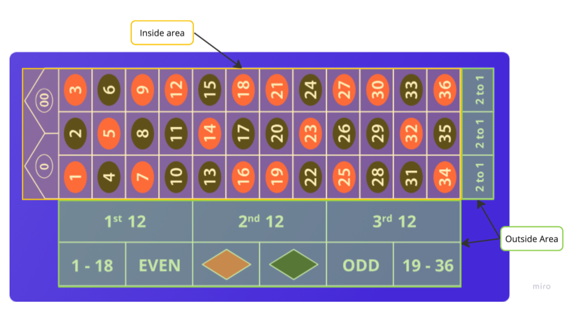
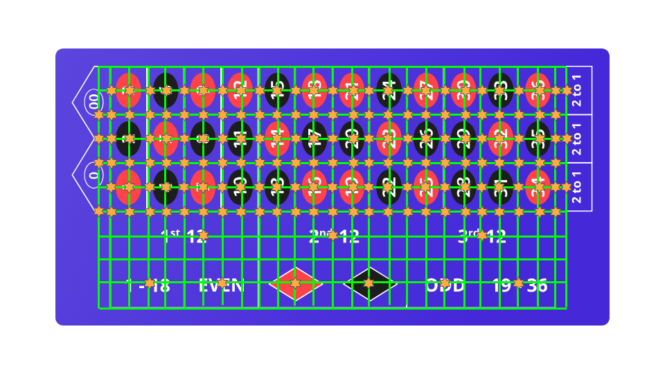
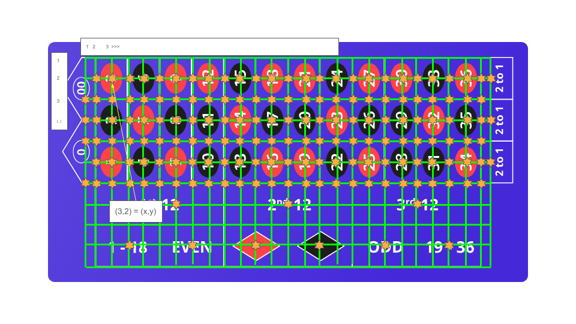

# Overview

- Roulette table is arranged in 2 sections: inside and outside
  - Inside area contains the 36 numbered squares, each either red or black
  - Outside area contains boxes that cover a broader range of numbers (e.g. odd or even)
  - At the top of the table, there are zero or double-zero boxes 

- Each square of the board (including zero/double-zero) are referred to as "pockets"
  - So in the American roulette board (i.e. with a double-zero), there are 38 pockets (36 numbered plus two "zero" pockets)
- The inside board can be further divided to represent combinations of pockets that correspond to different bet types, according to:

| Grouping | Description                                              |
| -------- | -------------------------------------------------------- |
| Split    | 2 numbers, either from adjacent rows or adjacent columns |
| Street   | 3 numbers, corresponding to a complete row of the table  |
| Corner   | 4 numbers, as formed by a 2x2 matrix of pockets          |
| Six Line | 6 numbers, as formed by combining 2 adjacent streets     |
| Top Line | 5 numbers, as formed by combining the first two rows (i.e. the "zero" row and adjacent) | 

# Grid Implementation

From this understanding of the board and possible coverages of multiple pockets, we can start to form a coordinate-grid to represent every space on the table that a bet can "occupy" (i.e. every option that a player can select).

This creates a grid that is 11 rows by 27 columns (rows and columns assume the table is oriented "east-west", with zero/double-zero positioned on the left side of the frame)

However, within this xy coordinate-grid, not every coordinate will represent a valid position.  In fact, according to the rules there will only be a total of 170 valid inputs

Based on this, we can say that each grid coordinate has a number of properties, including:
- Inside or outside
- Pocket(s) covered
  - Can be one or many
- Grouping
  - as noted above this can include split, street, corner etc.
  - These map (1-1???) to payouts
- Payout odds 

For the purposes of a UI, we would also say that a coordinate "object" would also need to serve as a "container" for that may or may not hold a users' bet 

So assuming a east-west = x and north-south=y, ascending numbering scheme like this:

We could show = the coordinate (4,7) as 

| Inside Outside? | Pockets | Grouping | Payout Odds | 
| --------------- | ------- | -------- | ----------- |
| Inside | [1,2,3,4,5,6] | Six-Line | 5:1 |

